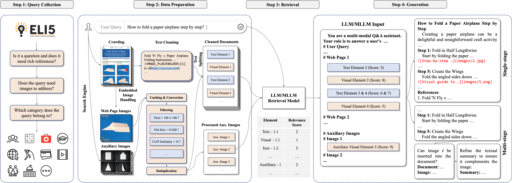

<div align="center">

# Multi-modal Retrieval Augmented Multi-modal Generation

</div>

<h5 align=center>

[](https://arxiv.org/abs/2411.16365v3)
[](https://huggingface.co/collections/ylwt/m2rag-674695ac8d94d45f6b801482)
[](https://github.com/maziao/M2RAG/blob/main/LICENSE)
[](https://github.com/maziao/M2RAG/stargazers)

</h5>

Implementation of paper [Multi-modal Retrieval Augmented Multi-modal Generation: Datasets, Evaluation Metrics and Strong Baselines](https://arxiv.org/abs/2411.16365v3)



## 🔥 News

- **2025 Feb 19:** Paper updated on [arXiv](https://arxiv.org/abs/2411.16365v3). Code and other resources are released. Online demo is coming soon.
- **2024 Nov 25:** Paper available on [arXiv](https://arxiv.org/abs/2411.16365).

## 📋 Table of Contents

- [Multi-modal Retrieval Augmented Multi-modal Generation](#multi-modal-retrieval-augmented-multi-modal-generation)
  - [🔥 News](#-news)
  - [📋 Table of Contents](#-table-of-contents)
  - [🤗 Resources](#-resources)
  - [🚀 Getting Started](#-getting-started)
    - [🛠️ Installation](#️-installation)
    - [CLI Demo](#cli-demo)
    - [📈 Evaluation on M$`^2`$RAG-Bench](#-evaluation-on-m2rag-bench)
    - [How to Use Our Fine-tuned Models](#how-to-use-our-fine-tuned-models)
    - [🔧 Fine-tuning](#-fine-tuning)
  - [♻️ Reproduce Our Work](#️-reproduce-our-work)
  - [📎 Citation](#-citation)

## 🤗 Resources

| Item                                    | Repository                                                                                     |
| --------------------------------------- | ---------------------------------------------------------------------------------------------- |
| Benchmark Dataset                       | [🤗 ylwt/M2RAG-Bench](https://huggingface.co/datasets/ylwt/M2RAG-Bench)                        |
| Training Dataset                        | [🤗 ylwt/M2RAG-Distill-GPT-4o](https://huggingface.co/datasets/ylwt/M2RAG-Distill-GPT-4o)      |
| Distilled Model - Llama-3.1-8B-Instruct | [🤗 ylwt/M2RAG-Llama-3.1-8B-Instruct](https://huggingface.co/ylwt/M2RAG-Llama-3.1-8B-Instruct) |
| Distilled Model - Qwen2.5-7B-Instruct   | [🤗 ylwt/M2RAG-Qwen2.5-7B-Instruct](https://huggingface.co/ylwt/M2RAG-Qwen2.5-7B-Instruct)     |
| Distilled Model - Qwen2-VL-7B-Instruct  | [🤗 ylwt/M2RAG-Qwen2-VL-7B-Instruct](https://huggingface.co/ylwt/M2RAG-Qwen2-VL-7B-Instruct)   |


## 🚀 Getting Started

### 🛠️ Installation

1. **Create and activate a Conda environment:**

    ```shell
    conda create -n m2rag python=3.12 -y
    conda activate m2rag
    ```

2. **Clone the repository and install dependencies:**

    ```shell
    git clone https://github.com/maziao/M2RAG.git
    cd M2RAG
    pip install -r requirements.txt
    ```

3. **To use our fine-tuned models or fine-tune your own, install** [LLaMA-Factory](https://github.com/hiyouga/LLaMA-Factory).

4. **Configure environment variables** (make sure to modify the [.env](./.env) file first to fill in your API keys and other necessary details):

    ```shell
    source .env
    ```

### CLI Demo

- To start a new session:

    ```shell
    python cli_demo.py --query "How to fold a paper airplane step by step?"
    ```

- To resume from an interrupted session:

    ```shell
    python cli_demo.py --query "How to fold a paper airplane step by step?" --session-id "20250219-xxxxxx"
    ```

### 📈 Evaluation on M$`^2`$RAG-Bench

1. **Download the benchmark dataset:**

    ```shell
    bash scripts/download_benchmark_dataset.sh
    ```

2. **Generate M$`^2`$RAG results:**

    Customize your configuration for [LLM](./src/config/summarize_custom_llm.yaml) or [MLLM](./src/config/summarize_custom_mllm.yaml):

    ```shell
    python summarize.py --config-file ./src/config/summarize_custom_mllm.yaml
    ```

3. **Evaluate the results:**

    You can customize the evaluation configuration [here](./src/config/evaluate_custom.yaml).

    ```shell
    python evaluate.py \
      --summarize-log-dir ./log/summarize/summarizer-single_stage-vlm-openai-gpt-4o-2024-08-06 \
      --config-file ./src/config/evaluate_custom.yaml
    ```

### How to Use Our Fine-tuned Models

Take **Llama-3.1-8B-Instruct** as an example:

1. **Download the base model checkpoint:**

    **Note**: You need to agree to share your contact information to [access Llama-3.1-8B-Instruct](https://huggingface.co/meta-llama/Llama-3.1-8B-Instruct).

    ```shell
    # If the checkpoint has not been downloaded:
    mkdir -p models/Llama-3.1-8B-Instruct/original
    huggingface-cli download meta-llama/Llama-3.1-8B-Instruct \
      --local-dir models/Llama-3.1-8B-Instruct/original

    # If the checkpoint has already been downloaded:
    mkdir -p models/Llama-3.1-8B-Instruct
    ln -s PATH_TO_CHECKPOINT models/Llama-3.1-8B-Instruct/original
    ```

2. **Download the LoRA adapter:**

    ```shell
    mkdir -p models/Llama-3.1-8B-Instruct/LoRA
    huggingface-cli download DataHammer/T2I_Eval-MiniCPM-V-2_6 \
      --local-dir models/Llama-3.1-8B-Instruct/LoRA
    ```

3. **Merge the LoRA adapter with the base checkpoint:**

    ```shell
    bash finetune/scripts/llama_factory_merge_lora.sh finetune/config/merge/llama_3_1_merge_lora.yaml 0
    ```

4. **Deploy with vLLM:**

    ```shell
    bash scripts/vllm/deploy_llama_3_1.sh
    ```

### 🔧 Fine-tuning

Take fine-tuning **Llama-3.1-8B-Instruct** on **2 × NVIDIA A100-SXM4-80GB GPUs** as an example. You can modify your configuration [here](./finetune/config/sft/llama_3_1_lora_sft_ds2.yaml) to suit different setups. Be sure to prepare the base models following the instructions in the previous section.

1. **Download the training dataset:**

    ```shell
    bash scripts/download_training_dataset.sh
    ```

2. **Convert the raw dataset to ShareGPT format:**

    ```shell
    bash finetune/scripts/prepare_llama_factory_dataset.sh
    ```

3. **Start fine-tuning:**

    ```shell
    bash finetune/scripts/llama_factory_finetune.sh finetune/config/sft/llama_3_1_lora_sft_ds2.yaml 2 0,1
    ```

## ♻️ Reproduce Our Work

For detailed instructions on reproducing our work, please refer to [this guide](./REPRODUCE.md).

## 📎 Citation

If you find this repository useful for your research, please cite our paper:


```bibtex
@misc{ma2025multimodalretrievalaugmentedmultimodal,
      title={Multi-modal Retrieval Augmented Multi-modal Generation: Datasets, Evaluation Metrics and Strong Baselines}, 
      author={Zi-Ao Ma and Tian Lan and Rong-Cheng Tu and Yong Hu and Yu-Shi Zhu and Tong Zhang and Heyan Huang and Xian-Ling Mao},
      year={2025},
      eprint={2411.16365},
      archivePrefix={arXiv},
      primaryClass={cs.CL},
      url={https://arxiv.org/abs/2411.16365}, 
}
```
