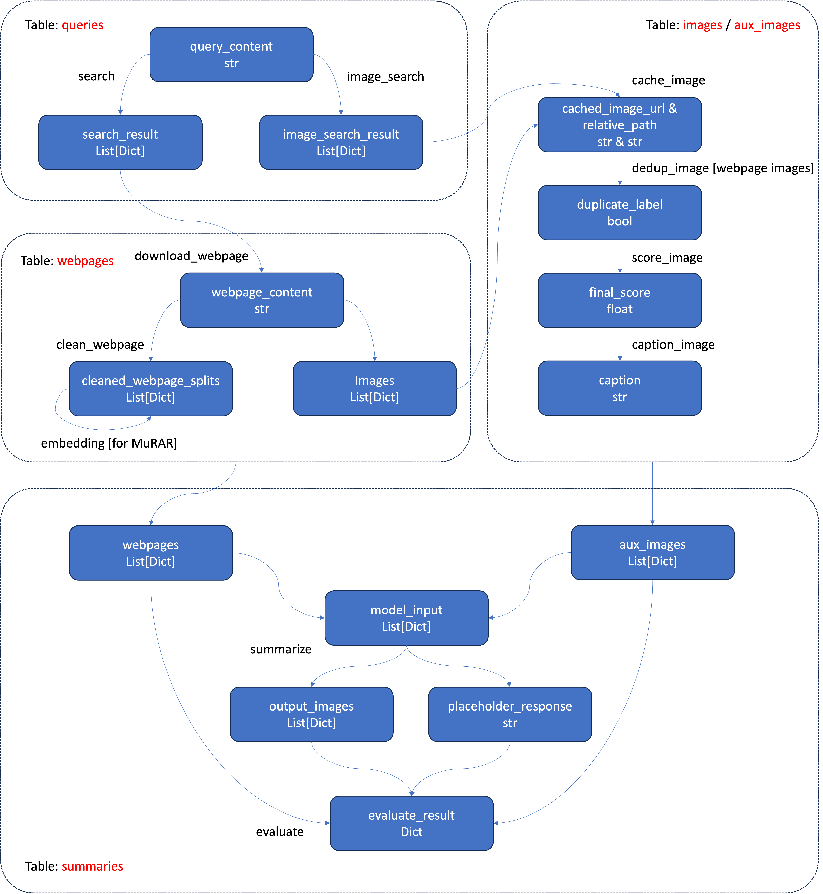

# Reproduce Our Work or Construct Your Own Datasets

To replicate the entire process of constructing the training and benchmark datasets, or to build a new M$`^2`$RAG dataset in large volumes, you'll need to install [MongoDB](https://www.mongodb.com/try/download/community) and the [MongoDB Command Line Database Tools](https://www.mongodb.com/try/download/database-tools).

## Restoring Our Dataset to MongoDB

If you wish to operate on our dataset, you can restore it to MongoDB with the following commands:

```shell
mongorestore --host 0.0.0.0 --port 27017 --nsInclude="m2rag.training_set.*" --dir=./data/training_set/mongodb_snapshot --gzip
mongorestore --host 0.0.0.0 --port 27017 --nsInclude="m2rag.dev_set.*" --dir=./data/dev_set/mongodb_snapshot --gzip
```

## Constructing Your Own Dataset

To construct your own dataset with new queries, first insert your queries into the `queries` table. Then, follow the workflow below to process your data.



### Workflow Overview

The workflow is illustrated in the figure above, where:

- Each rounded rectangle enclosed by a dashed line represents a database table.
- Each rounded rectangle with a blue background represents a field in the table.
- Each arrow represents an operation.

The process starts with `query_content` and `query_id`. All operations can be executed using the `watcher`. For example, to complete the `search` operation, you can run the following command:

```shell
python launch_watcher.py --config-file ./src/config/watcher_config/search.yaml
```

The `watcher` operates as a consumer, continuously retrieving search results for queries as long as there are queries without search results remaining in the table.

## Configuration Files

Configs for all operations can be found in the [watcher configuration directory](./src/config/watcher_config/).
